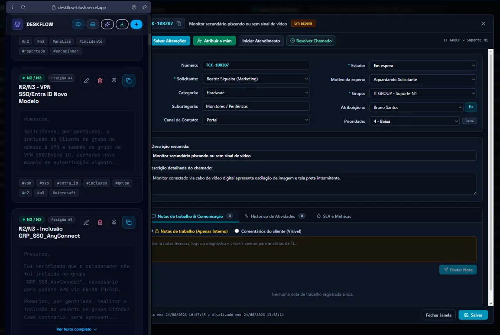

<div align="center">



# DeskFlow
**Operational productivity for IT Support**

<<<<<<< HEAD
[🚀 Demo](https://deskflow-blush.vercel.app) · [📘 User Manual](docs/DeskFlow_Manual_Completo.pdf) · [📚 Technical Docs](docs/technical.md) · [📦 Repository](https://github.com/riionansr/deskflow)
=======
[🚀 Demo](https://deskflow-blush.vercel.app) · [📘 User Manual](docs/DeskFlow_Manual_Completo.pdf) · [📦 Repository](https://github.com/riionansr/deskflow)
>>>>>>> 70554e04a9d311f5272195e234585181cfa1244b

</div>

---

## The problem

<<<<<<< HEAD
N1/N2/N3 analysts can lose valuable time rewriting the same replies, searching through scattered notes, or switching between tools to find the right procedure while an active case is already running against the SLA clock.

The problem isn't necessarily the lack of documentation — it's the **friction of finding and reusing the right information at the right moment**.

## The solution

**DeskFlow** is a lightweight operational productivity tool for centralizing, organizing and quickly retrieving standardized phrases, scripts and procedures used in IT Support. It's designed to work alongside the analyst's existing workflow, including browser sidebar usage next to a ticketing system.

Its search model combines **context + terms**, letting analysts narrow down large catalogs without manually browsing through them:

```text
#chat
#chat greeting

#power
#power access
```

*(examples use a fictional catalog, for illustration only)*

## Key features

- 🔎 **Contextual search** — combine hashtags, categories and keywords using AND logic
- 🏷️ **Context tags** — organize phrases by support flow, channel, system or situation
- 📌 **Pinned phrases** — keep frequently used scripts at the top of filtered results
- 📋 **One-click copy** — copy operational content directly to the clipboard
- ✍️ **Dynamic signature** — optionally append a configured signature to copied content
- 🗂️ **Custom categories** — organize catalogs according to the user's workflow
- 📥 **Document import** — process supported structured/text formats locally
- 📤 **Data export** — create portable backups of the catalog
- 🧭 **Sidebar workflow** — keep DeskFlow accessible next to the ticketing system
- 💾 **Local-first storage** — core catalog operations use data stored in the browser
- ☁️ **Optional synchronization** — remote sync can be enabled when needed

---

## Contextual search

DeskFlow treats tags as more than simple metadata — they can represent the **operational context** in which a phrase is used.

For example, `#chat` can identify a communication channel, while `#chat greeting` combines that context with a specific search term. The same approach applies to any other operational context in the catalog.

This lets analysts move from a broad context to a specific procedure without manually browsing the entire catalog. When a more explicit search is needed, `categoria:`/`cat:`/`c:` and `tag:`/`t:` prefixes target a specific category or tag directly.

## Real-world use case

DeskFlow was designed around a practical support workflow: analysts often need to find and reuse standardized content while actively handling tickets or customer interactions. Keeping that content scattered across local files, notes or past conversations creates unnecessary friction.

DeskFlow addresses this with a simple loop:

**Ticket → Context → Search → Result → Copy → Ticket**

The examples shown in this repository and its documentation use fictional environments and data for demonstration purposes.

---

## Privacy & BYOD

DeskFlow follows a **local-first / BYOD (Bring Your Own Data)** approach. The core catalog can be stored locally in the browser, without requiring a centralized DeskFlow database for basic operations.

Users can export their data for backup and portability. Optional external synchronization may provide additional capabilities — when enabled, data sent to external services is subject to the configuration, availability and policies of those services.

> DeskFlow should not be treated as a password manager, secrets vault, or a replacement for enterprise security systems.

> Full details on how data is handled are in the [User Manual](docs/DeskFlow_Manual_Completo.pdf) and the [Technical Documentation](docs/technical.md).

## Architecture

The application is primarily client-side:

```text
React / UI
    │
    ▼
Application Logic
    │
 ┌──┴───┐
 ▼      ▼
Search  Parser
Engine  / Import
 │      │
 └──┬───┘
    ▼
LocalStorage
    │
    ▼
Optional Sync (Firestore)
```

See [`docs/technical.md`](docs/technical.md) for the full breakdown — persistence model, parser, search engine and external integrations.

## Stack

- **Frontend:** React, TypeScript
=======
N1/N2/N3 analysts lose precious time rewriting the same replies, digging through outdated wikis for the right procedure, or copy-pasting from old tickets — all while a live case is already running against the SLA clock.

## The solution

**DeskFlow** is a lightweight, fast portal to centralize, organize and speed up the use of standardized phrases, scripts and operational procedures during IT support. It runs entirely in the browser, is built to sit in your browser's sidebar next to your ticketing system, and gets you the right answer in seconds — with instant search, tags and automatic signature.

## Key features

- 🔎 **Instant search** by title, category and hashtags (`#VPN`, `#Password`, `#Printer`...)
- 📋 **One-click copy** with your personal signature attached automatically
- 📌 **Pin frequently used phrases** to the top of the catalog
- 🗂️ **Custom categories and tags** per support flow
- 📥 **Document import** (.txt, .docx, .json) with 100% local structural parsing
- 📤 **Standardized export (.txt)** ready for wikis, Git or operational manuals
- 🧭 **Sidebar mode** — use side-by-side with your ticketing system and browser AI assistants

## Privacy & BYOD

DeskFlow follows a **local-first (BYOD — Bring Your Own Data)** model: by default, data lives in the analyst's browser `localStorage`. There is no BYOK and no generative-AI integration — all document reading and importing is done through deterministic algorithms, with no content ever sent to external services. Cloud sync (Firestore) is **optional** and exists solely to share the catalog across a team.

> Full details on how it works, privacy and integrations are in the [User Manual](docs/DeskFlow_Manual_Completo.pdf).

## Stack

- **Frontend:** TypeScript, 100% client-side
>>>>>>> 70554e04a9d311f5272195e234585181cfa1244b
- **Storage:** `localStorage` (local-first)
- **Optional sync:** Firestore
- **Deploy:** Vercel

## Documentation

<<<<<<< HEAD
This README covers the product/engineering overview. Two dedicated docs go deeper:

📘 **[User Manual](docs/DeskFlow_Manual_Completo.pdf)** — operational workflow, import/export, contextual search and sidebar setup (Opera, Firefox, Edge, Chrome).

📚 **[Technical Documentation](docs/technical.md)** — architecture, persistence/BYOD, parser, search engine and external integrations.

```
docs/
├── DeskFlow_Manual_Completo.pdf   # Operational manual + productivity guide
└── technical.md                   # Architecture & engineering notes
=======
This README covers the product/engineering overview. For the full operational walkthrough — support workflow, import/export and sidebar setup on Opera, Firefox, Edge and Chrome — check the manual in `/docs`:

```
docs/
└── DeskFlow_Manual_Completo.pdf   # Operational manual + productivity guide (sidebar setup)
>>>>>>> 70554e04a9d311f5272195e234585181cfa1244b
```

## Getting started

<<<<<<< HEAD
Ideas under consideration for upcoming versions — check the repo's issues for the current status:

- [ ] Team spaces with segmented catalogs
- [ ] Direct export to Confluence/Notion
- [ ] Keyboard shortcuts for search and copy

## Getting started

DeskFlow is web-based — just open the [live app](https://deskflow-blush.vercel.app) and start using it.

For local development:

```bash
git clone https://github.com/riionansr/deskflow.git
cd deskflow
npm install
```

Then run the dev script defined in `package.json` to start the local server.
=======
DeskFlow is 100% web-based — just open the [live app](https://deskflow-blush.vercel.app) and start using it. To pin it to your browser's sidebar (recommended), check the step-by-step guide in the manual above.
>>>>>>> 70554e04a9d311f5272195e234585181cfa1244b

---

<div align="center">
DeskFlow Community • Built for people who live in Service Desk
</div>
